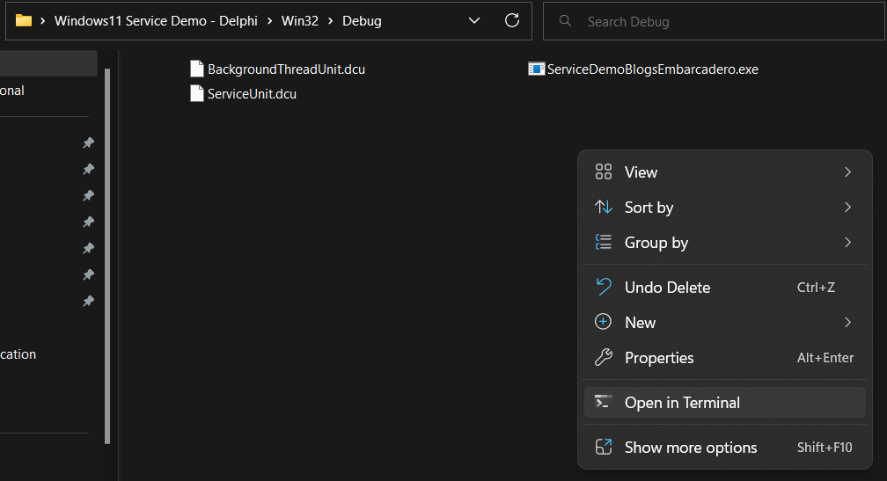
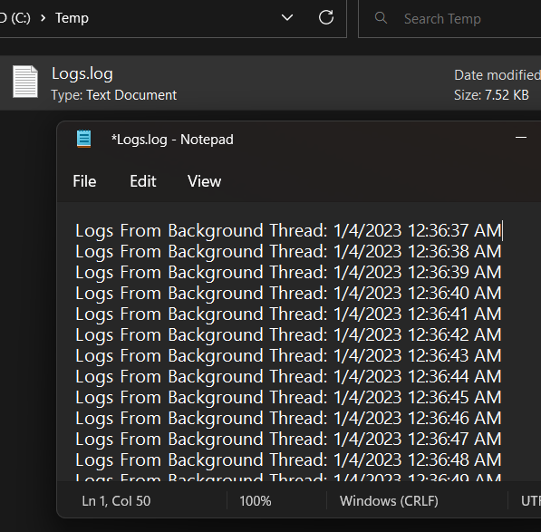
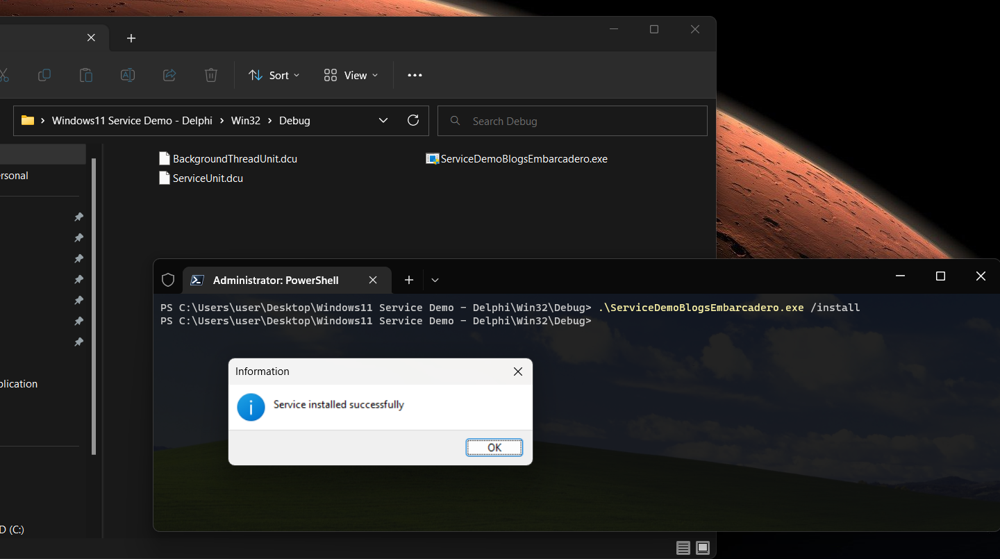
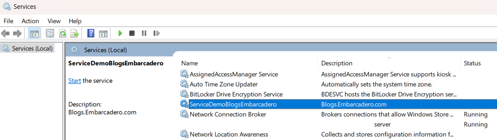

# Windows-11-Service-Demo---TService
https://blogs.embarcadero.com/

- Go to the folder and open in terminal (the executable file should be configured to run as an administrator privileges)
- Type the service name with "/install" command

